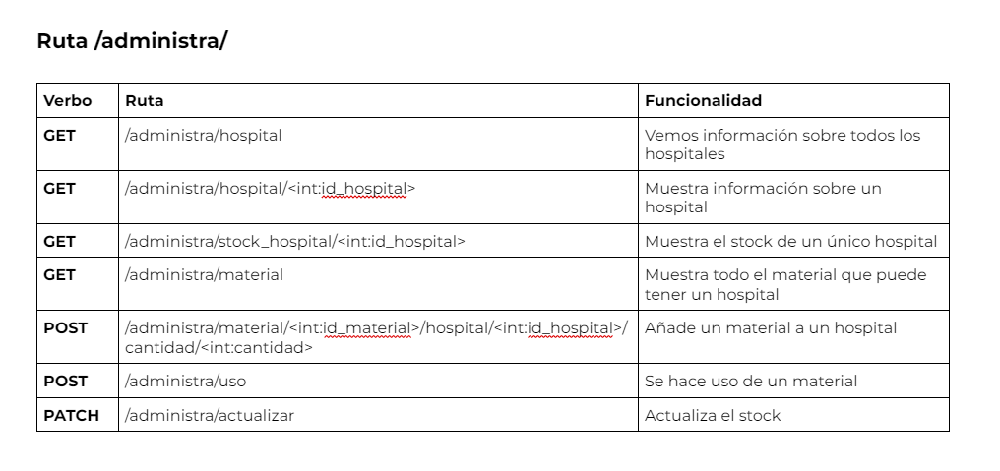
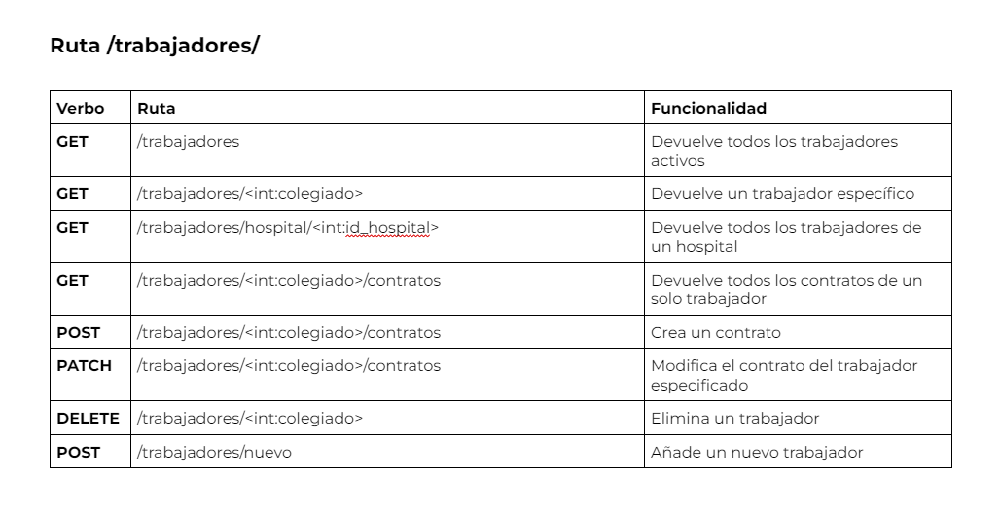
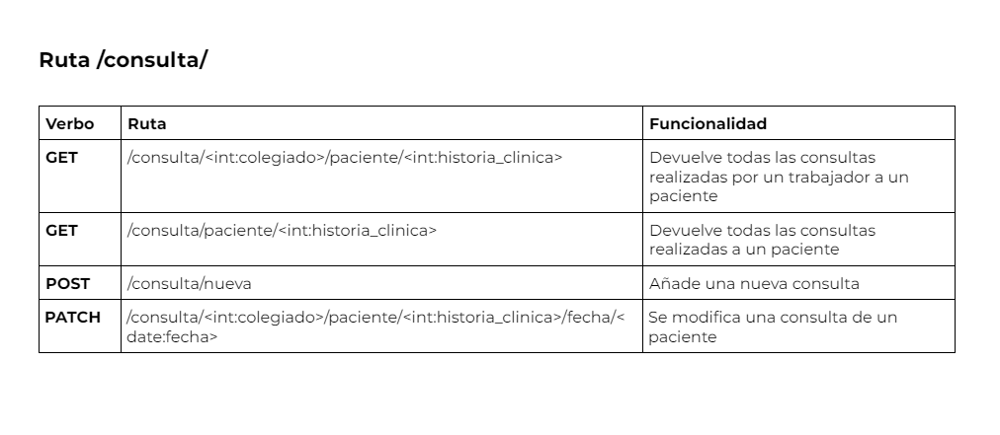
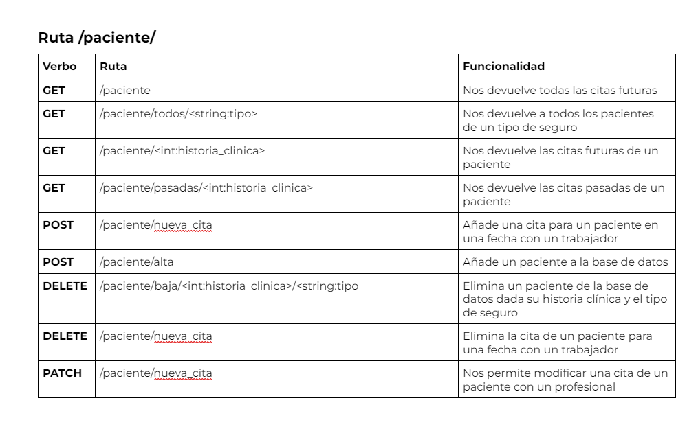

# Proyecto_ADBD
## Integrantes del grupo 6 de trabajo:
  - Concepción Peña, Evian (alu0101395548@ull.edu.es)
  - García Bautista, Alejandro (alu0101387604@ull.edu.es)
  - Plasencia Hernández, Edwin (alu0101329888@ull.edu.es)

## Resumen de lo que se encuentra en este repositorio
En este repositorio se encuentra una API REST desarrollada con Python, Flask y psycopg2 para la asignatura de Administración y Diseño de Base de Datos que nos proporciona funcionalidades para la gestión de una cadena de hospitales privados, realizando la gestión de:
  - Materiales 
  - Trabajadores
  - Consultas médicas
  - Pacientes
  - Citas médicas.

## Rutas y Funcionalidades
### Ruta Administra

### Ruta Trabajadores

### Ruta Consulta

### Ruta Paciente


## Como se hace uso de esta API
Es necesario tener Docker instalado en el sistema para poder levantar un contenedor que nos permita tener nuestra base de datos PostgreSQL, ademas de tener una versión minima de Python de 3.8.9 asi como de Pip para poder instalar y preparar el entorno de desarrollo, para ello hay que ejecutar los siguientes comnados:
```bash
git clone <enlace a este repositorio>
cd Proyecto_ADBD/
python3 -m venv venv
source venv/bin/activate
pip3 install Flask
pip install psycopg2-binary
```

Una vez todo instalado se puede levantar en una de las terminales la API REST con el siguiente comando:
```bash
flask --app API-SaludTFE run --host 0.0.0.0 --port=8080
```

Con la API desplegada abrimos una nueva terminal y ejecutamos los siguientes comandos dentro de la raiz del repostirio:
```bash
cd scripts/
chmod +x script_ini.sh
./script_ini.sh
```

Una vez ejecutado el comando nos encontraremos en la bash del contenedor y debemos ejecutar los siguientes comandos:
```bash
cd docker-entrypoint-initdb.d/
psql -U postgres
# Dentro de la consola de psql ejecutamos los siguiente
\i build.sql
```
Con esto tenemos todo preparado para hacer uso de la API REST de SaludTFE.
